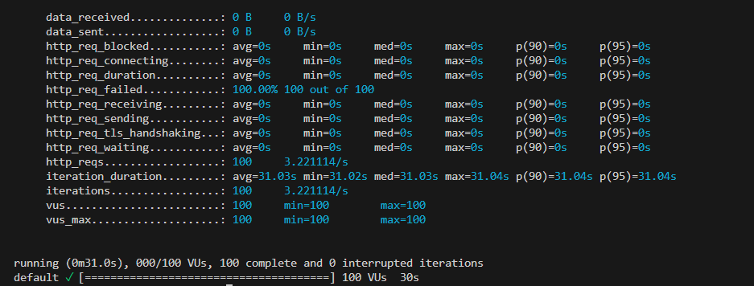

# Self-hostin

El objetivo de esta práctica es realizar hosting en servidores propios. 
La practica la he realizado con `Netlify` y `Vagrant`.

## Netlify

Es un proveedor de alojamiento que puedes utilizar para sitios web estáticos o aplicaciones web.

 

## Requerimientos

- **Maquina Virtual**: Configuración en la maquina virtual de `Vagrant`.
- **Github-Netlify**: Un respositorio en `Github` que este enlazado a `Netlify`.

## Pasos para la configuración

En este proyecto, asigné mi dirección IP dinámica al nombre de dominio utilizando únicamente los servicios de **Netlify** y **GitHub**. A continuación, te explico cómo se configura la actualización automática de la IP con **GitHub ** y **Netlify**.

#### 1. Usando GitHub y Netlify

En lugar de comprar un dominio personalizado o utilizar un servicio de DNS dinámico tradicional, utilicé **Netlify** para alojar mi sitio web y obtener un subdominio gratuito, como `emurochisp.netlify.app`. Este subdominio me permitió acceder a mi servidor a través de un nombre de dominio, sin ningún costo adicional.

**Pasos realizados:**

1. **Configuración del Subdominio en Netlify:**
   - **Netlify** proporciona un subdominio gratuito para cualquier proyecto que subas a su plataforma. Por ejemplo, `emurochisp.netlify.app`. Esto me permitió usar un subdominio sin tener que comprar un dominio.
   - Netlify también proporciona HTTPS gratuito para todos sus subdominios, lo que asegura que el tráfico hacia mi servidor esté cifrado y protegido.

2. **Uso de GitHub  para Servir el Sitio Web:**
   - En lugar de usar un servidor tradicional, utilicé **GitHub** para servir el contenido estático de mi sitio web. GitHub  me permite alojar sitios web directamente desde un repositorio de GitHub.
   - Subí el código de mi sitio web, incluidas las configuraciones necesarias (como el archivo `index.html` y demás recursos estáticos), a un repositorio público en **GitHub**.
   - GitHub configuró automáticamente un subdominio, pero redirigí el tráfico hacia mi subdominio en **Netlify**, que se encargó de la gestión DNS.
   
3. **Configuración de IP Dinámica con Netlify:**
   - Cuando la IP de mi servidor cambia (porque es una IP dinámica), no es necesario un servicio adicional de DNS dinámico. **Netlify** maneja las actualizaciones automáticas del subdominio, lo que significa que no tengo que preocuparme por la IP, ya que Netlify se encarga de redirigir el tráfico hacia el servidor correctamente, siempre que esté configurado adecuadamente.

#### 1.1. Sin Costo Adicional

Usando únicamente **GitHub** y **Netlify**, logré una solución completamente gratuita, sin necesidad de pagar por un dominio o un servicio de DNS dinámico externo. Esta solución también me permite mantener la seguridad del tráfico mediante el uso de HTTPS proporcionado por **Netlify**.

**Documentación relevante:**
- [GitHub Pages](https://pages.github.com/)
- [Netlify - Configuración de DNS](https://www.netlify.com/docs/dns/)

### 2. Redirección de puertos en el router

Dado que estoy utilizando **Netlify** para alojar mi sitio web, no es necesario realizar ninguna redirección de puertos en mi router residencial. Esto se debe a que **Netlify se encarga de toda la infraestructura del servidor**, incluyendo la gestión de puertos para acceso HTTP (puerto 80) y HTTPS (puerto 443).

En un escenario tradicional donde se aloja un servidor en casa, sería necesario configurar la redirección de puertos en el router para permitir que el tráfico externo llegue al servidor. Sin embargo, al utilizar **Netlify**, esta configuración se realiza automáticamente en la plataforma sin intervención del usuario, ya que Netlify gestiona los servidores y la infraestructura de manera transparente.

Por lo tanto, no tuve que preocuparme por la traducción de direcciones (NAT) ni por la configuración de puertos en mi red local. **Netlify se encargó del redireccionamiento y la gestión de los puertos** (80 para HTTP y 443 para HTTPS), permitiendo que mi sitio web sea accesible desde cualquier lugar sin necesidad de modificar la configuración de mi router o ISP.

#### 2.2. Servidor Web

En este proyecto, dado que estoy utilizando **Netlify** para alojar el sitio web, no es necesario configurar un servidor web como **Apache** ni gestionar certificados SSL/TLS manualmente. **Netlify** se encarga de toda la infraestructura del servidor web, incluyendo el manejo de puertos y la configuración de seguridad.

##### 2.2.1. Software

En lugar de instalar un servidor web como **Apache 2.4+**, **Netlify** proporciona su propia infraestructura de servidores web gestionados de forma automática. Netlify se encarga de todas las configuraciones necesarias para servir el contenido estático de mi sitio web.

##### 2.2.2. Puertos

En lugar de configurar puertos como **80 (HTTP)** y **443 (HTTPS)** en un servidor Apache, **Netlify** maneja automáticamente la conexión a través de estos puertos. No es necesario realizar ninguna configuración adicional, ya que **Netlify** asegura que el tráfico llegue a mi sitio web a través de los puertos adecuados:

- **HTTP (puerto 80)**: Redirigido automáticamente a **HTTPS**.
- **HTTPS (puerto 443)**: Se gestiona automáticamente para asegurar la conexión a mi sitio web.

##### 2.2.3. Certificados

Una de las grandes ventajas de usar **Netlify** es que no es necesario gestionar certificados SSL/TLS manualmente. Netlify proporciona **certificados SSL gratuitos** para todos los subdominios, lo que garantiza que mi sitio web esté siempre disponible de forma segura mediante HTTPS.

- **Certificado HTTPS**: **Netlify** automáticamente emite y renueva los certificados SSL para tu subdominio, utilizando **Let’s Encrypt** o un sistema similar, lo que asegura que todo el tráfico esté cifrado de forma predeterminada.
- **No es necesario configurar certificados manualmente**: No tuve que preocuparme por configurar un certificado autofirmado ni un certificado proporcionado por un agente de registro como IONOS. **Netlify** se encargó de todo el proceso, lo que facilita la administración de la seguridad de mi sitio web.

### 3. Página de Inicio

En mi implementación, he creado una página de inicio básica llamada `index.html`, que sirve como la página principal de bienvenida al servidor. Este archivo se encuentra en la raíz de mi repositorio y Netlify lo maneja de forma automática al hacer el despliegue del sitio.

**Contenido de `index.html`:**
- La página de inicio contiene un mensaje simple que da la bienvenida al usuario al servidor. 
- El archivo `index.html` está completamente disponible y es accesible desde la URL raíz de mi dominio proporcionado por **Netlify**.

**URL de la página de inicio**: 
- Al acceder a mi sitio web, la URL principal (por ejemplo, `https://emurochisp.netlify.app/`) mostrará esta página de bienvenida.

#### 3.1. Páginas de Error Personalizadas

He configurado una página de error personalizada para mostrar un mensaje adecuado cuando los usuarios intenten acceder a recursos que no existen en el servidor.

**Página de error 404**:
- Si un usuario accede a una URL no disponible, como por ejemplo `https://emurochisp.netlify.app/xyz`, se le redirige automáticamente a una página de error 404 personalizada. Esta página le informa que el recurso solicitado no se encuentra disponible.
- La página de error 404 está configurada para ser gestionada por **Netlify** y se muestra en caso de que el recurso no exista en el sitio.

**Comportamiento de la página 404**:
- Si el archivo `xyz` o cualquier otro recurso no se encuentra en el sitio, **Netlify** devuelve automáticamente la página 404 personalizada sin necesidad de configuraciones adicionales en el servidor.

#### 3.2. Descargar una Imagen

He incluido una imagen llamada `logo.png` en el proyecto, que se puede descargar accediendo a la ruta `/logo.png` en el servidor.

**Características de la imagen**:
- La imagen `logo.png` tiene un tamaño cercano a 1MB.
- Esta imagen puede ser descargada accediendo a la URL `https://emurochisp.netlify.app/logo.png`.
- He utilizado esta imagen para realizar pruebas de rendimiento y descarga.

### 4. Administración

### 5. Status

### 6. Prueba de Rendimiento

Realicé una prueba de rendimiento utilizando **k6**, una herramienta moderna para pruebas de carga. En lugar de usar Apache Benchmark (ab), elegí **k6** porque es más flexible y permite un control más detallado sobre las pruebas. Esta prueba se realizó desde una máquina distinta al servidor, como se recomienda, para simular el comportamiento real de los usuarios accediendo al sitio.

#### 6.1. Configuración de la Prueba

Cree un archivo `.js` (`test.js`) para la configuracion de la prueba de rendimiento de **k6** en el que puedo decidir las peticiones y usuarios.

(el siguiente codigo es equivalente a la prueba de **Prueba con 1000 usuarios concurrentes y 10000 peticiones**)

```bash
    import http from 'k6/http';
    import { sleep } from 'k6';

    export const options = {
    vus: 1000,
    iterations: 10000, 
    };

    export default function () {
    http.get('https://emurochisp.netlify.app');
    sleep(1)
    }
```

- **Recursos Probar**:
  1. Página principal: `https://emurochisp.netlify.app` (con SSL/TLS habilitado).
  2. Imagen: `https://emurochisp.netlify.app/logo.png`.
  3. Recurso con autenticación: `https://emurochisp.netlify.app/admin/` (con autenticación básica).

#### 6.2. Resultados de la Prueba

A continuación se presentan los resultados obtenidos para las pruebas de carga, con un enfoque en la interpretación de los datos de rendimiento:

1. **Prueba con 100 usuarios concurrentes y 1000 peticiones**:

 

2. **Prueba con 1000 usuarios concurrentes y 10000 peticiones**:

 

#### 6.3. Conclusión

`Netlify` es una plataforma de hosting que está optimizada para ofrecer un rendimiento confiable y estable en escenarios de tráfico normal, como los que se encuentran en el uso cotidiano de un sitio web por parte de usuarios reales. E

stá diseñada para manejar cargas razonables de solicitudes, pero no está pensada para soportar pruebas de carga masivas que simulan un número elevado de usuarios concurrentes de manera artificial. 

Estas pruebas generan un volumen de tráfico inusualmente alto en un corto período de tiempo, lo cual activa los mecanismos de protección de la plataforma, como el control de concurrencia, límites de ancho de banda o sistemas de rate limiting, que están destinados a garantizar la estabilidad del servicio para todos los sitios alojados en la plataforma. 

Por lo tanto, las pruebas de carga masiva tienden a fallar debido a estas limitaciones inherentes a la arquitectura de `Netlify`.

### 7. Web

este ha sido el trabajo realizado para la practica Self